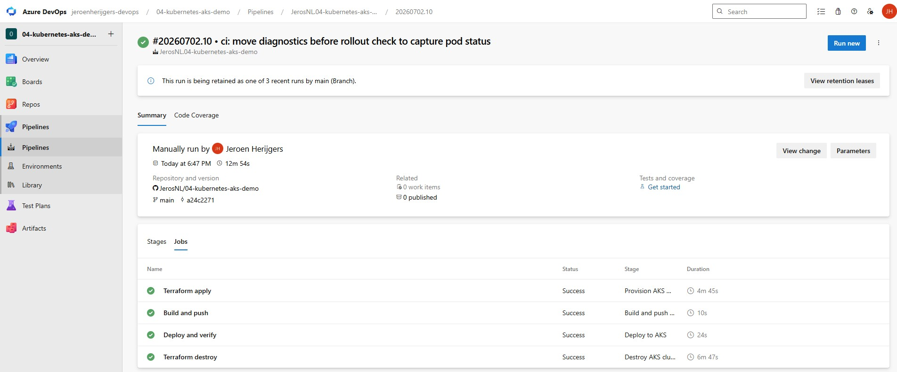
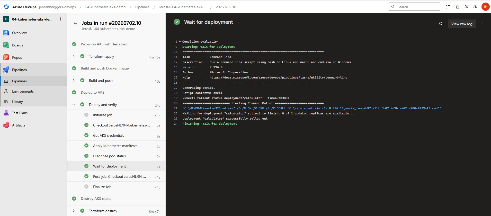
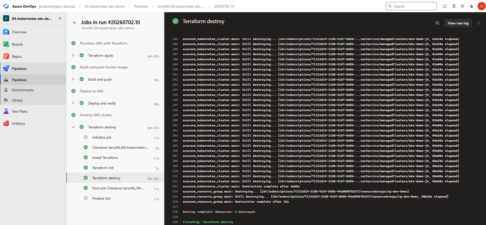

# Kubernetes AKS Demo

## What this is

A Python calculator app deployed to Azure Kubernetes Service through a fully automated Azure DevOps pipeline. This is my fourth hands-on DevOps project, combining Terraform, Docker and Kubernetes into a single end-to-end pipeline.

## What the pipeline does

```
Provision AKS with Terraform -> Build and push Docker image -> Deploy to AKS -> Destroy cluster
```

The AKS cluster exists only for the duration of the pipeline run, roughly 10 to 15 minutes. Terraform creates it at the start and destroys it at the end, keeping costs to a few cents per run.

## Pipeline stages

**Provision** - Terraform provisions a resource group and AKS cluster in Azure West Europe using a single Standard_D2s_v3 node to keep costs minimal.

**Build** - Docker builds the calculator image with tests running inside the build, then pushes to GitHub Container Registry with a unique build ID tag and a latest tag.

**Deploy** - kubectl applies the Kubernetes manifests and waits for the pod to reach a running state before marking the stage as complete.

**Destroy** - Terraform destroys all resources using `condition: always()` so the cluster is cleaned up even if the deploy stage fails.

## What I learned

- Kubernetes uses a declarative model, you describe the desired state in manifests and the control plane works to match reality to that description
- A Deployment manages pod lifecycle automatically, if a pod crashes Kubernetes restarts it without any manual intervention
- A Service provides a stable network endpoint in front of pods, since pods come and go with changing IP addresses
- `condition: always()` on the Destroy stage is important because it ensures the cluster is destroyed even if earlier stages fail, which prevents unexpected costs
- AKS worker nodes are the main cost driver, destroying them after each demo run keeps costs near zero
- `ErrImagePull` means the cluster cannot pull the container image. In production this is solved with a Kubernetes image pull secret rather than making the image public
- `kubectl rollout status` is the correct way to wait for a deployment to complete in a pipeline

## Tech used

- Terraform
- Azure Kubernetes Service (AKS)
- Docker
- GitHub Container Registry (ghcr.io)
- kubectl
- Azure DevOps Pipelines
- Self-hosted Windows agent

## Project structure

```
terraform/          Provisions the AKS cluster
k8s/                Kubernetes manifests
  deployment.yaml   Pod specification and replica count
  service.yaml      Load balancer and network endpoint
src/                Calculator application
tests/              pytest unit tests
Dockerfile          Container image definition
```

## Screenshots



